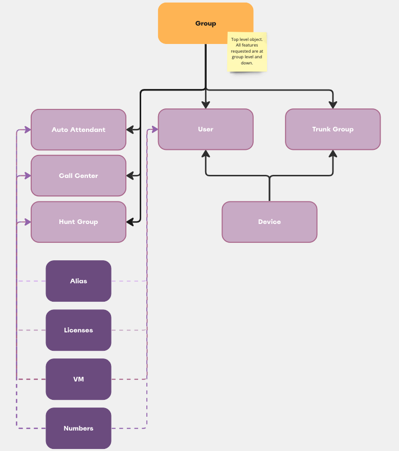

# odin_api
Python package for Odins API to build and manage Broadwork installations.

[Odin API Docs](https://doc.odinapi.net/)

## Solution Design

## Broadwork Relationships
NOTE: After stakeholder interviews main functionalities requested for solution are group level and down. This is the initial goal however all API functionalities will be added once achieved.
