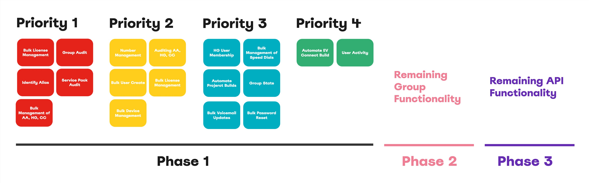
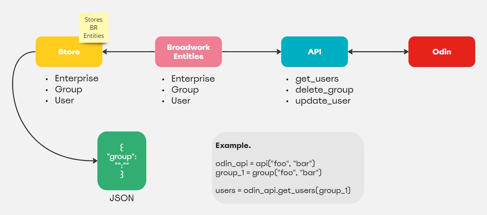
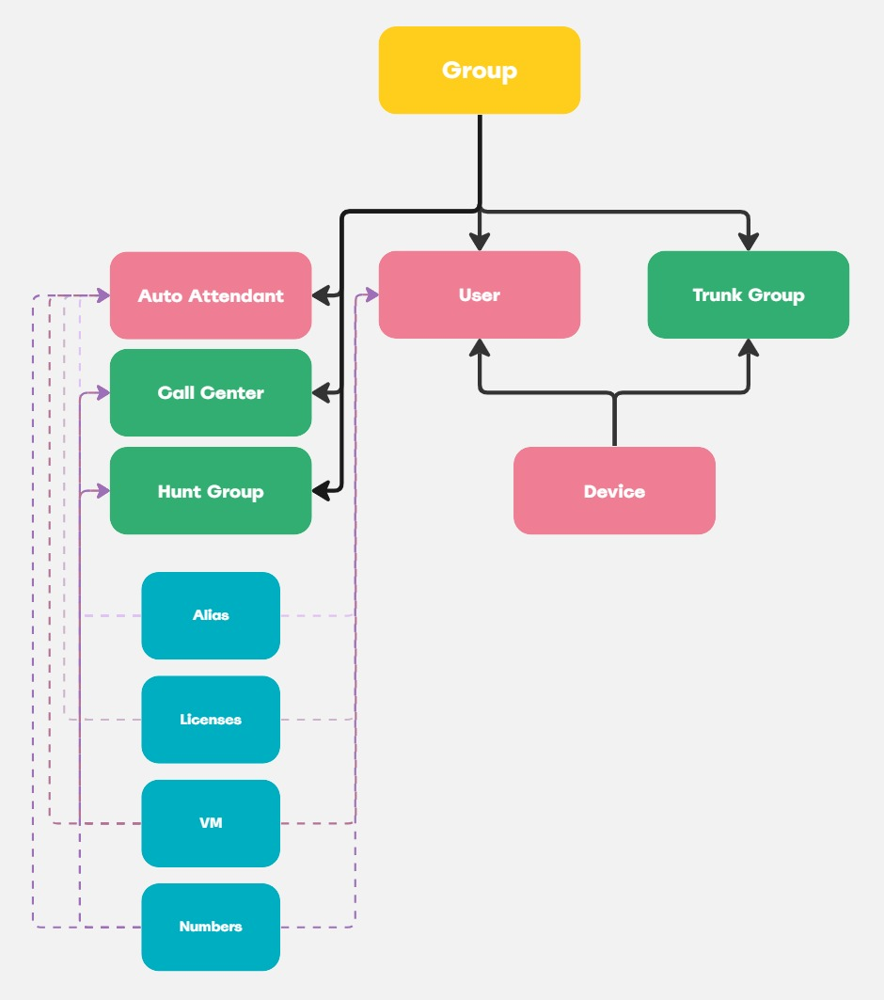

# odin_api
Python package for Odins API to build and manage Broadwork installations.

[Odin API Docs](https://doc.odinapi.net/)

## Project Scope
NOTE: Some functionality is Fourteen IP Specific and not relevant outside of the company (25/11/23).

## Solution Design

## Broadwork Relationships
NOTE: After stakeholder interviews main functionalities requested for solution are group level and down. This is the initial goal however all API functionalities will be added once achieved.

## Official Documentation
[odin_api Documentation](https://docs.jordan-prescott.com/odin_api/)

## Contact
If you have any questions or suggestions, feel free to reach out at [jprescott23@gmail.com](mailto:jprescott23@gmail.com).
