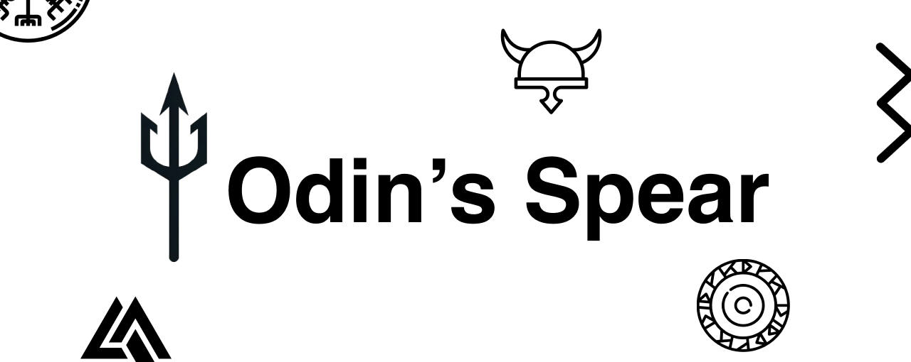

# 👋 Welcome!!

Working on Broadwork's for 5 years was painful, with its stiff 90’s user interface and all its limitations so when I first saw Odin by [Rev.io](https://www.rev.io/blog/solutions/rev-io-odin-api). I nearly fell off my seat. Those beautiful people brought the solution into the 21st century with a modern user interface, automation, and most of all its API. This made my life so much easier, I was able to build 500 users in one go rather than one by one, I could give users access to manage their own systems, and I could duplicate groups with everything I needed when building new groups for customers. But I still couldn’t easily locate where the alias 0 was assigned and here is where the story of Odin’s Spear begins.

Odin’s web user interface is great but it’s not perfect and it's limited, however, its API is a gift sent from the developer gods over at Rev.io (thank you!). Using the documentation and a few lines of code you can achieve everything you can achieve in the web interface but you are no longer limited to how fast you can operate your keyboard with the power of programming languages like Python. I can create a loop to create 10, 100, 1000, or 10, 000 users, hunt groups, and call centers in seconds or minutes.

Managing them all becomes a breeze also, let's say a customer has a new user they want to add to all 50 of their hunt groups (if you’ve read this far I’m assuming you know what this is). If you’re using Broadworks then block the day out in your calendar, if you're using Odin’s web portal block the morning out, if you're using Python with the Odin API block 30 minutes out (that’s being generous).

[Odin API Documenation](https://doc.odinapi.net/)

Alas, using the API is not perfect, each time I would write a script to help me achieve these things I was hit with some recurring issues, I would have to find the API call I needed, format the data, design the request, handle any errors that could occur and the list goes on. Each time I was starting fresh and this was frustrating, if only there was a solution that handled my authentication, I could just select the method and pass it the data rather than designing the request, if an error occurs tell me what the issue is, resolve or even handle it for me…

## Introducing...

**Odin’s Spear** is a Python library that aims to do exactly that. It will encapsulate the entire functionality of Odin’s API making the use easy, efficient, and accessible. The project is stakeholder lead and all features have come from engineers that have been using Broadworks and now Odin for decades. It will also introduce other features requested such as a graph showing a call flow to a number, a group audit report for all things billable, and bulk management of call centers, hunt groups, and auto attendants. However, it was clear what the first feature had to be. For years now locating where an alias has been assigned on the Broadworks system has brought hosted telephony engineers to their knees. No more. With Odin’s Spears’ very first release (beta) I have addressed this issue making locating an alias a breeze. In 3 lines of code and 1 minute of your time, you can now achieve this once painstaking task, and more features are coming soon!

## 📖 Documentation

We have extensive docs on how to get started, and all the features we have built. Check them out below:

[Odin's Spear Documenation](https://docs.jordan-prescott.com/odins_spear)