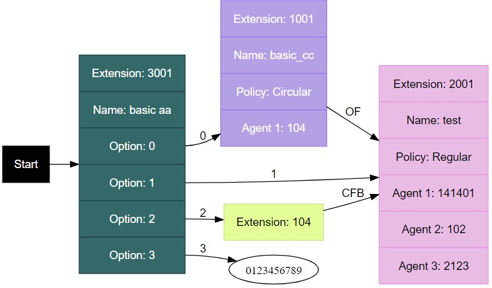

# 🔑 Abbreviation Key

<figure><figcaption>
Example of Call Flow showing abbreviations.
</figcaption></figure>

| Abbreviation | Meaning                           |
| ------------ | --------------------------------- |
| CFB          | Call Forward Busy                 |
| CFNR         | Call Forward Not Reachable        |
| CFA          | Call Forward Always               |
| OF           | Overflow                          |
| NACF         | No Answer Call Forward            |
| BCT          | Bounced Call Transfer             |
| SCF          | Stranded Calls Transfer           |
| USCF         | Unavailable Stranded Call Tranfer |

