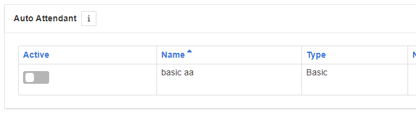

# 🟢 PUT - Auto Attendants Status

In this method, you can control the status of your auto attendants (AA) by activating and deactivating them. The method takes in two parameters, they are a list of the AA service user IDs and a status which is a boolean value of True (Active) or False (Deactivate).

### Parameters&#x20;

* auto\_attendant\_user\_ids (list): List of service user IDs (AA IDs), the status given will be applied to these.
* status (bool): Boolean value of True (Activate) or False (Deactivate) which will be applied to list of AAs.

### Returns

* None: This method does not return any specific value.

### How To Use:

The below code will set the AA to deactivated.


```python
from odins_spear import api

my_api= api.Api(base_url="https://base_url/api/vx", username="john.smith", password="ODIN_INSTANCE_1")
my_api.authenticate()

auto_attendants = [
    "basic_aa@domain.com"
]

my_api.put.auto_attendants_status(
    auto_attendant_user_ids= auto_attendants,
    status= False
)
```


#### Result:

<figure><figcaption><p>Basic AA updated to deactivated.</p></figcaption></figure>

